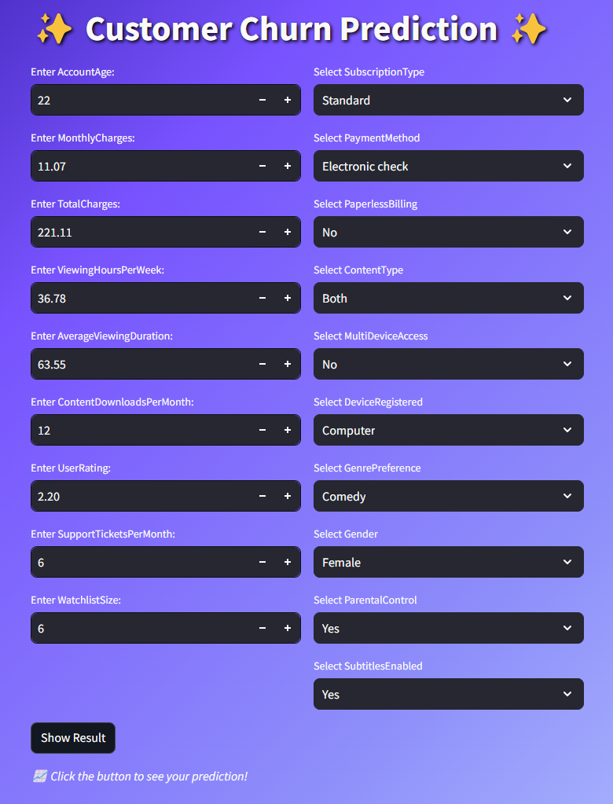

# Customers churn prediction using ML
**Churn:** It is the measure of how many customers stop using a product.
## Workflow:
1. Data collection
2. EDA
3. Data preprocessing
4. Split the data (train-test)
5. ML models
6. Best trained model
7. Make Prediction (Unknown data)
>Download the dataset from here: 
>>[data.csv](https://drive.google.com/file/d/15Rf1lVLQGq721Bc-46ps9LIbrFU8UVzx/view?usp=sharing)

>Large files has be replaced by text files, which contains the drive file link.
## Prerequisites:
> Install the required dependencies
1. requirements.txt
2.  also download the following library
```shell
conda install -c conda-forge imbalanced-learn
```
## Dashboard of Project
